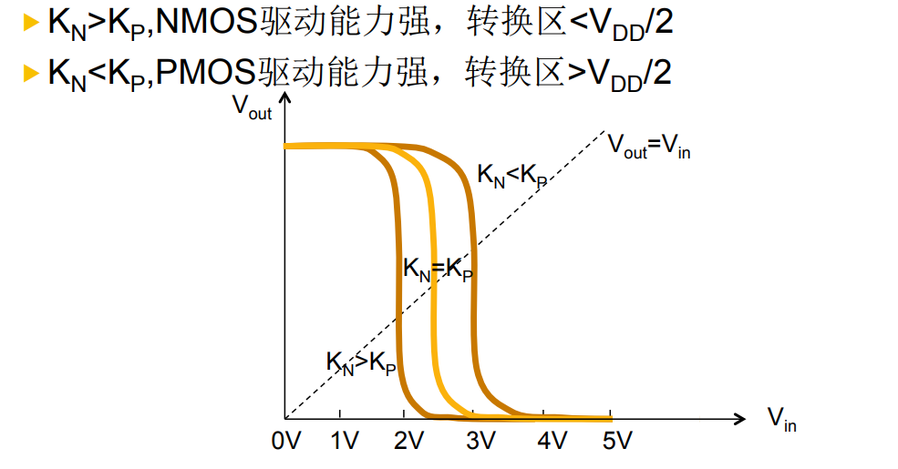

# 微电子电路

## 第一章 绪论

摩尔定律：每18-24个月，晶体管数目翻倍

等比例缩小：特征尺寸是前代的0.7倍，则密度是前代的2倍。

数字电路：处理离散的信号；模拟电路：处理连续变化的信号

## 第二章 COMS基本元件

### 半导体

本征半导体：不掺杂

温度升高会使少数价电子脱离共价键的束缚变成**自由电子**，浓度用pi表示，留下**空穴**，浓度用ni表示；自由电子和空穴统称为载流子。

杂质半导体分为N(negative)和P(positive)型两种，参入的原子被称为施主原子，导电能力大大提高，但整体显电中性。

- N型：参入V族元素如磷，此时n>>p，多子为**自由电子**，少子为空穴。
- P型：参入III族元素如硼，此时p>>n，多子为**空穴**，少子为电子。

特别地：参入杂质的浓度决定了多子的浓度，温度决定少子的浓度。

### PN结

P型半导体和N型半导体的交界处产生了薄层，称为PN结。

载流子的运动分为扩散运动和漂移运动。

- 扩散运动（空穴移动方向从P到N）：由电子和空穴的浓度差造成。扩散运动会导致正负离子之间产生电位差（内电场方向从N型指向P型），出现内电场称为电位壁垒，阻止扩散运动。
- 漂移运动（空穴移动方向从N到P）：出现内电场后，异性电荷相吸产生漂移运动。方向与扩散运动相反。

#### 单向导电性

PN结具有单向导电性，**外加电场方向与漂移运动一致**时，即与**内电场方向相反**时导通。此时的电压称之为正向电压（P接电源正极，N接电源负极，外电场方向由P型指向N型）。

正向电压一定程度上促进了漂移运动，从而促进了扩散运动。扩散电流>漂移电流，PN结电流产生。

反向电流又称反向饱和电流。对温度十分敏感，随着温度升高，Is将急剧增大。这是因为漂移运动主要由温度决定。

#### 电流关系

PN结所加端正向电压u与流过的电流i的关系为
$$
i=I_S(e^{\frac {qV}{kT}}-1)
$$
V为正向偏压，Is为反向饱和电流。

PN结加反向电压时，扩散电流基本不随电压变化。

电流电压关系：

#### 电容

当PN上的电压发生变化时，PN 结中储存的电荷量将随之发生变化，使PN结具有电容效应。

外加电压的电势差增加时，产生放电电流，空间电荷区宽度增加。外加电压的电势差减小时，产生充电电流，空间电荷区宽度减小。这个电容称之为势垒电容。

### MOS结构

MOS是金属-氧化物-半导体的缩写。在金属和半导体之间加偏置电压VG时，会出现以下状况。

1. 多子累计：

   - p型：VGB<0，栅极充满电子
   - n型：VGB>0，栅极充满正电荷

2. 多子耗尽：

   - p型：VGB>0，栅极出现正电荷，衬底出现耗尽层（不能移动的受主离子，带负电）
   - n型：VGB<0，栅极出现负电荷，衬底出现耗尽层（不能移动的受主离子，带正电）
   
3. 表面反型：

   - p型：VGB>>0，栅极出现更多正电荷，衬底耗尽层被脱离氧化物表面，出现新的反型层（电子）
   - n型：VGB<<0，栅极出现更多负电荷，衬底耗尽层被脱离氧化物表面，出现新的反型层（空穴）

   

3. 强反型：

   - p型：VGB>VT，反型加剧，表面电子浓度>空穴浓度，电子被牢牢吸引在氧化物表面（限制在沟道内），称为P型沟道
   - n型：VGB<VT，反型加剧，表面空穴浓度>电子浓度，空穴被牢牢吸引在氧化物表面（限制在沟道内），称为N型沟道

不难发现，p沉底反型层和耗尽层都显负电，这是因为正电已经被外电场推到了衬底底端，远离氧化物。

MOS结构也存在电容，由氧化物层和衬底层电容并联得来。在VG从小到大的过程中（pmos衬底），总电容在耗尽层显著减小，后又在反型层显著增大。

### MOSFET器件

分为源区S、漏区D、栅极G、衬底区B。

对于nmos管，漏源之间加偏压后，电位低的一端为源， 电位较高的一端为漏，pmos管相反。在反相器中这可以很好的体现出来，nmos提供低电平，源极接地；pmos提供高电平，源极接VDD。

#### 阈值电压

阈值电压VT时使半导体达到强反型的栅压。

pmos管VT>0,nmos管VT<0;

- 增强型：必须施加电压才能形成沟道
- 耗尽型：自然地存在沟道，要主动施加反向电压才能关闭器件。

四种类型的MOSFET器件（沟道名称与衬底相反）：

#### MOSFET器件阈值电压

衬偏效应(体效应)：衬底偏压VBS导致阈值电压变化 

#### MOSFET器件的电流电压关系

随着VGS和VDS增大，依次经过截止区、线性区、饱和区、击穿区 

1. 截止区：

   - pmos：VGS<VT 
   - nmos：VGS>VT (VTN<0)

2. 线性区：I随VDS的变化近似线性关系

   - pmos：VGS>VDS+VT>VT
   - nmos：VGS<VT+VDS<VT

   

   也可以改写成对称形式：
   

3. 饱和区：增大VDS会造成漏端沟道夹断，存在临界电压
   

   - pmos：VDS+VT>VGS>VT
   - nmos：VT+VDS<VGS<VT

#### MOSFET器件的瞬态特性

MOSFET管也能体现电容的性质。主要由以下几个部分构成：

## 反相器

逻辑上输出取反，还能用于调整波形，结构上由一个nmos和一个pmos共漏极组成。

输入为0时，MN打开，输入为1时MP打开，轮流导通。

### 直流特性

- NMOS:截止区<->饱和区<->线性区
- PMOS:线性区<->饱和区<->截止区

NMOS和PMOS可以同时导通并且IDN=IDP.

随着输入电压的改变，可以分为以下几个阶段:

1. NMOS截止，PMOS线性

   可以解方程：

2. NMOS饱和，PMOS线性

   可以解方程：

3. NMOS饱和，PMOS饱和

   可以解方程：

   此外，定义Vit为转换电平，**Kr=KN/KP**

4. NMOS线性，PMOS饱和

5. NMOS线性，PMOS线性
   略

对称反相器KN=KP,VTN=-VTP,Vit=VDD/2

否则有：

KN>KP时，由于NMOS管负责下拉电路，所以Vit向0偏移，同理KN<KP时。

同样地，NMOS和PMOS不同的阈值电压也会使Vit偏向某一方，阈值电压也代表了MOS的驱动能力，阈值电压越小，MOS管越容易被驱动。

#### 噪声容限

### CMOS反相器的负载电容

电容由三部分组成：

#### 传输延迟时间的计算

##### 延迟时间

上升延迟时间：TPHL，输入端上升，输出端表现为下降，由NMOS管驱动

下降延迟时间：TPLH，输入端下降，输出端表现为上升，由PMOS管驱动

延迟时间记为从输出从0/VDD到VDD/2的时间。

若为了使得反相器对称，一般使

- KN=KP:(W/L)P×K’P=(W/L)N×K’N
- VTN=-VTP

##### 上升、下降时间

输出上升时间(Tr )： V10% ～V90%，Tr ≈ 3tPLH 

输出下降时间(Tf )： V90% ～V10%，Tf ≈ 3tPHL

#### 反相器的级联

## 基本单元电路

### 静态CMOS逻辑电路

逻辑门基本画法，NMOS画取反，PMOS扩展为和之积因为：nmos总逻辑要取反，pmos单个输入逻辑需要取反。

例如：

为了实现Y=-((A+B)C+D)

nmos实现-Y：(A+B)C+D

pmos实现：((-A)(-B)+(-C))(-D)

#### 计算逻辑门的直流特性

##### 与非门

假设三者都处于线性区，同时串联电路满足三者电流相等。可以解方程得：

假设三者都处于线性区，同时支路电流等于干路电流之和。可以解方程得

##### 等效反相器翻转电平

根据等效的反相器参数，就可以套用反相器的公式得到与非门的翻转电平

##### 输入信号不同步的

如果A=VDD,则pmos截止，nmos开启

这样的时候Vit也会相应的变化，体现在PMOS的驱动能力变弱了（从2KP到KP），Vit向着NMOS控制的低电平移动。

#### 最差情况分析

串联支路最长，并联仅有一个支路导通。为节省成本，仅需优化关键路径上的电路，来保证最佳性能。

#### 用静态CMOS实现组合逻辑

以异或电路为例：

Y=A(-B)+(-A)B

PMOS实现：(-A)B+A(-B)

NMOS实现-Y：AB+(-A)(-B)

### MOS传输门

#### 单MOS管

NMOS管传输高电平损失：

此时NMOS管在饱和区,并且随着放电的进行，源极电压生高，存在体效应，联立方程：

解得：

NMOS管传输低电平无损失：不存在体效应

NMOS管结束于线性区，解方程得Vo=0

PMOS传输高电无损失，结束于线性区，无体效应。

PMOS传输低电平有损失，始终处于饱和区，存在体效应。

#### 互补传输门

传输高电平使用PMOS,低电平使用NMOS

### 动态CMOS逻辑电路

#### 预充求值

仅存在下拉网络，在时钟的一半时间进行预充，另一半求值。

#### 富NMOS电路

上升传输延迟为0，若存在富NMOS与富NMOS直接级联或者，富PMOS与富PMOS直接级联,可能会破坏电路的正常输出。

## 数字集成电路子系统设计

### 6-T SRAM单元

1. 读：预充BL,-BL至VDD/2，打开字线。

   

   电压的改变会被双稳态电路立刻平衡，不会引起读造成的数据的错误或损失。

2. 写：BL=DATA,-BL=-DATA
   

由于使用的是nmos管，放电能到0，充电只能到VG--VTN，但是电压差会被双稳态电路立刻放大

### DRAM

写：由于使用的是nmos管，逻辑0能正确写，逻辑1只能写入VG-VTN。

读：位线预充至VDD/2，导通后根据位线电压的改变幅度和极性来判断存储信息。
预充VBL为电平中间值，可保证： 

- 若ΔV为正，则读到逻辑1

- 若ΔV为负，则读到逻辑0

### 逻辑译码器

把BL接入逻辑单元，读出逻辑之后BL,-BL再经敏感放大器放大。

### 地址译码器

选择一组A0A1A2,对应的nmos管会打开，传输低电平，行本身就具有高电平。

#### 树状译码器

经过晶体管太多，慢。

#### ROM

与地址译码器类似，不同的是只有某一行会打开。数据能一组一组的读出。

#### D锁存器

C=1，数据D写入。

#### RS触发器

触发器用于时序逻辑

#### 行波加法器

串联，需要等待上一位的处理完成

#### 超前进位加法器

假设n位加法器可以分为k组，每组4位。

每组可以并行运算GG和GP，经过一级逻辑门就可以得到 组进位输出信号

## CMOS集成电路设计与制造

